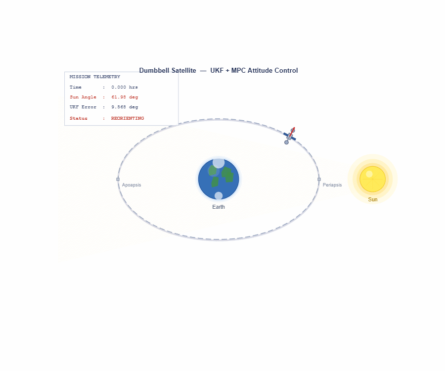
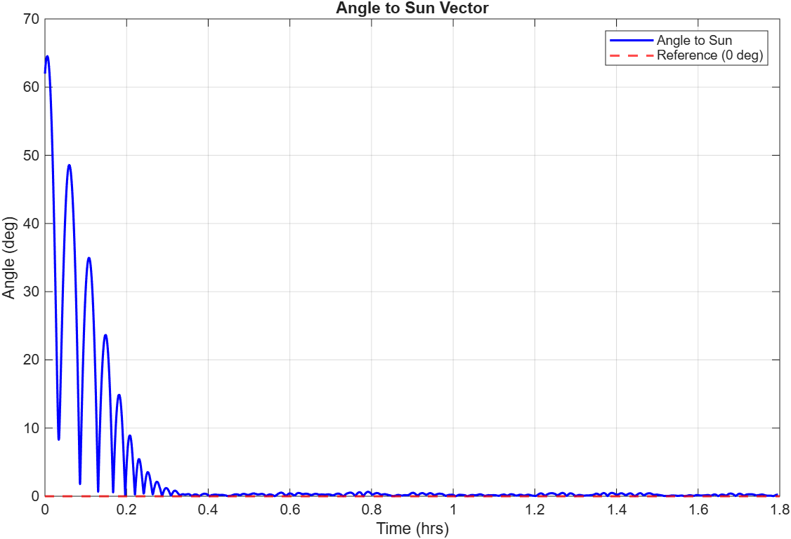
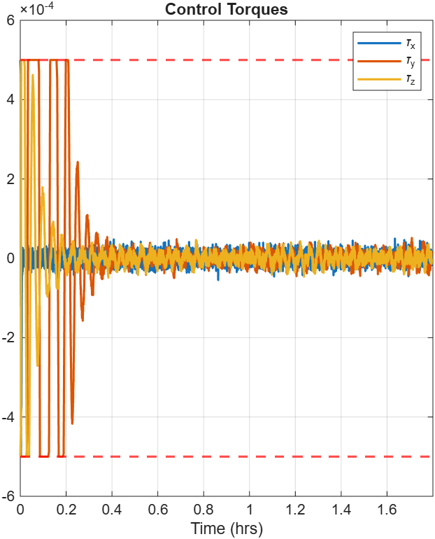
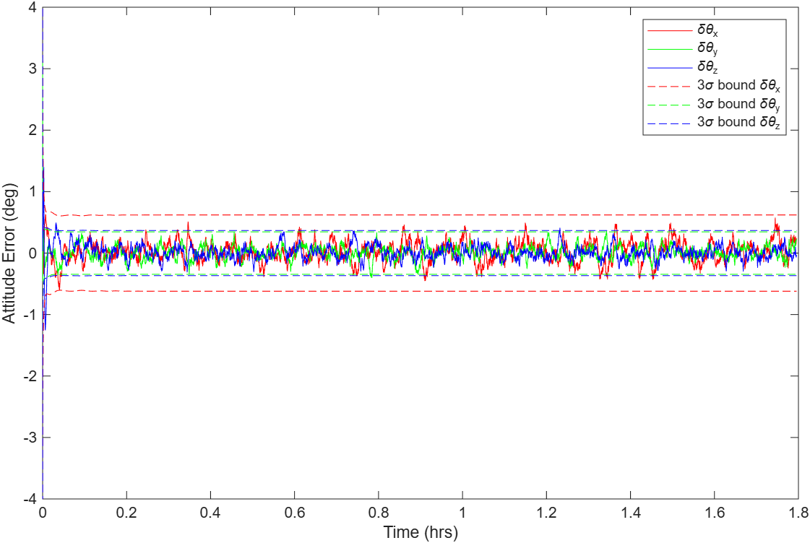

# Dumbbell Satellite Attitude Control — UKF + MPC

> **Note:** This repository contains my individual implementation 
> of the MPC algorithm and UKF-MPC closed-loop integration, 
> developed as part of a team project for AAE 568 at Purdue University. 
> Full project report included for technical reference.

## Overview
Closed-loop attitude estimation and control system for a rigid dumbbell-shaped satellite on an eccentric orbit (e=0.6). An Unscented Kalman Filter (UKF) fuses gyroscope, sun sensor, and magnetometer measurements for full-state attitude estimation, which feeds a Model Predictive Control (MPC) algorithm that computes optimal reaction wheel torques over a 10-step prediction horizon subject to actuator constraints.

Developed as part of AAE 568 — Applied Optimal Control and Estimation, Purdue University (Spring 2026).



*Figure 1: Dumbbell satellite on an eccentric orbit (e = 0.6) around Earth, with the Sun at periapsis. The UKF fuses gyroscope, sun sensor, and magnetometer data to estimate attitude, while MPC computes optimal reaction wheel torques over a 10-step prediction horizon.*

## System Description
- **Satellite:** Dumbbell configuration — two spherical masses connected by a thin rod
- **Orbit:** Eccentric (e=0.6), inclination 70°, SMA 7500 km
- **Attitude representation:** Unit quaternion
- **Sensors:** Gyroscope (0.01°/s noise) + Sun sensor (0.5° noise) + Magnetometer (1.0° noise) with first-order Gauss-Markov bias model

## Key Components

### UKF — Unscented Kalman Filter
- 6-state error-state formulation: attitude error (3) + gyroscope bias (3)
- Sigma point propagation using quaternion kinematics
- Measurement update fusing sun vector and magnetometer observations
- Gyroscope bias estimation with first-order Markov correlation model (τ = 2000s)

### MPC — Model Predictive Control
- Prediction horizon: N = 10 steps, sampling period Ts = 1s
- Linearized discrete-time error-state model about sun-pointing equilibrium
- Actuator torque constraints: |τ| ≤ 5×10⁻⁴ N·m per axis
- Quadratic cost: Q = 0.05I₆, R = 50I₃
- Condensed batch QP solved via MATLAB mpcActiveSetSolver

### Closed-Loop Architecture
UKF estimate → MPC → Plant (RK4) → UKF (receding horizon)

## Results

### Sun-Pointing Convergence
MPC drives 65° initial misalignment to within 1° of sun-pointing in under 0.3 hours and maintains it for the full orbital period.



### Control Torques
All three torque channels saturate at ±5×10⁻⁴ N·m during initial reorientation and settle well within bounds after convergence.



### UKF Attitude Estimation Error with 3σ Bounds
Attitude errors settle within ±0.5° and remain bounded by 3σ envelopes for the full orbital period, confirming filter consistency.



## Dependencies
- MATLAB R2021a or later
- Aerospace Toolbox
- Model Predictive Control Toolbox

## Repository Structure
```
project-root
│
├── Matlab                    # MATLAB simulation & control scripts
│   └── UKF_MPC.m             # UKF-MPC controller implementation
│
├── figures                   # Simulation plots and results
│   ├── satellite_attitude_control.gif   # Attitude animation
│   ├── sun_angle.png
│   ├── torques2.png
│   └── ukf_sigma.png
│
├── Report                    # Project documentation
│   └── DARE_KF.pdf
│
└── README.md
     
```

## Course
AAE 568 — Applied Optimal Control and Estimation
Purdue University, Spring 2026
